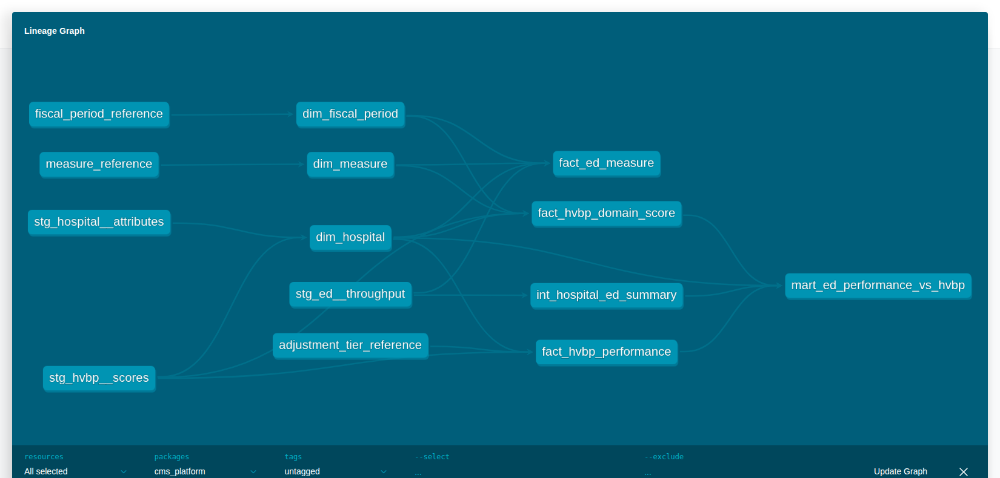

# CMS Hospital Performance Platform


A data platform, not two demo scripts: CMS Hospital Value-Based Purchasing
(HVBP) financial-impact data and CMS Inpatient Quality Reporting (IQR)
Emergency Department throughput data, merged into one config-driven
ingestion layer, one dbt star schema, and one read API — with a real bug
found and fixed on the way, and one finding at the end that reports what
the data actually says.

There is no `/predict` endpoint and no model in this repo. The ML in this
portfolio lives in the retrieval system and the denial agent, not here —
see "What this repo demonstrates" below.

## Architecture

```
CMS HVBP CSV (data/raw/)              CMS IQR "Emergency Department" slice
        |                                          |
        |                              PySpark ingest + standardize
        |                          (transform/spark_jobs.py, not run in CI —
        |                           raw multi-condition IQR export too large
        |                           to commit; committed output below)
        |                                          |
        v                                          v
              Config-driven loader (ingest/loader.py)
     one engine, two YAML configs (config/sources/cms_hvbp.yml, cms_iqr.yml)
        dtype hints applied at read time, validation, CCN normalization
                                   |
                                   v
                    Bronze layer (data/bronze/*.csv)
                                   |
                                   v
                  dbt staging (stg_hvbp__scores, stg_ed__throughput,
                                stg_hospital__attributes)
                                   |
                                   v
              dbt intermediate (int_hospital_ed_summary)
                                   |
                                   v
       dbt marts: dim_hospital, dim_measure, dim_fiscal_period,
                  fact_ed_measure, fact_hvbp_domain_score,
                  fact_hvbp_performance, mart_ed_performance_vs_hvbp
                                   |
                                   v
              FastAPI read API (api/main.py)  +  Power BI dashboards
```

dbt targets **DuckDB by default** — `dbt build --profiles-dir dbt` runs the
entire warehouse locally from a fresh clone, no credentials required.
Snowflake is a documented alternate target (`DBT_TARGET=snowflake` plus
`SNOWFLAKE_*` env vars, `dbt/profiles.yml`); staging models read Bronze
directly via DuckDB's `read_csv()` (`dbt/macros/read_bronze.sql`), so the
Snowflake path needs the Bronze CSVs loaded into `RAW` tables first
(`snowflake/*.sql`) and that macro swapped for a `source()` read against
them — everything downstream of staging (intermediate, marts, tests) is
warehouse-agnostic SQL and needs no changes. That staging-layer swap is the
one seam not implemented in this build.

Lineage, generated by `dbt docs generate`:



## Key finding

Hospitals were grouped into quartiles by ED boarding time (proxy: OP_18d,
median minutes before transfer to another facility — see "Data model"),
and their mean HVBP Total Performance Score (TPS) was compared quartile to
quartile:

| Boarding time quartile | Mean boarding time (min) | Mean TPS | n |
|---|---|---|---|
| Q1 (fastest) | 233 | 33.07 | 270 |
| Q2 | 301 | 33.36 | 271 |
| Q3 | 360 | 33.96 | 270 |
| Q4 (slowest) | 489 | 31.78 | 268 |

**Spearman ρ = −0.0254 (p = 0.40, n = 1,079 hospitals with both metrics) —
ED boarding time shows no meaningful relationship to overall HVBP Total
Performance Score in FY2026.** Mean TPS is flat across quartiles (33.1 →
33.4 → 34.0 → 31.8); nothing about it moves monotonically with boarding
time.

That's a reasonable result to report as-is: ED throughput measures aren't
HVBP components (HVBP scores Clinical Outcomes, Safety, Person & Community
Engagement, and Efficiency — none of which is ED wait time), so a weak
relationship is the expected finding, not a failed analysis. n = 1,079 is
smaller than the 2,451-hospital CCN overlap between the two sources (see
below) because OP_18d — a transfer-time measure — isn't reported by every
hospital (small facilities with few transfers report "Not Available").

This is **correlational and cross-sectional**: one fiscal year (FY2026), no
lag applied. Nothing here implies ED performance causes reimbursement
outcomes — see "Data limitations".

Reproduce it: `python -m cms_platform.analysis.ed_hvbp_finding` (after
`dbt build`).

## Data model

**dim_hospital** — one row per CCN seen in *either* source, with
`present_in_hvbp` / `present_in_ed` coverage flags rather than an inner
join, so coverage gaps are visible instead of silently dropped.

**dim_measure** — one row per measure across both sources (7 ED measures +
5 HVBP domain/total scores), with `domain`, `direction`
(`higher_is_better` / `lower_is_better` / `not_applicable`), and `unit`.

**dim_fiscal_period** — FY2026 rows per reporting domain, with
`performance_start` / `performance_end` / `lag_years`. HVBP FY *N* scores a
performance window that runs roughly *N−2* to *N−3* relative to the fiscal
year, and that window **differs by domain** (Efficiency uses a shorter,
more recent window than Clinical Outcomes or Safety) — exact CMS-published
per-domain dates weren't reproduced here to avoid stating figures this
project couldn't independently verify (see `dbt/seeds/fiscal_period_reference.csv`
for what is and isn't populated). The ED throughput windows *are* precise,
because they're read directly from the data: EDV/OP_22 use calendar year
2024; OP_18a-d/OP_23 use a rolling ~12-month window (2024-07 to 2025-06).
**With a single fiscal year of HVBP data, the lag can't actually be
exercised** — the model is built to carry it because a second fiscal year
should slot in without a schema change, not because this build demonstrates it.

**fact_ed_measure**, **fact_hvbp_domain_score**, **fact_hvbp_performance** —
one row per hospital × measure × period; one row per hospital × domain;
one row per hospital × fiscal year, respectively.

**mart_ed_performance_vs_hvbp** — the analysis-ready wide table: ED
measures pivoted per hospital, HVBP total + domain scores, and
within-state / within-ED-volume-peer-group percentile ranks on boarding
time.

**Boarding time proxy**: this measure set (EDV, OP_18a–d, OP_22, OP_23) has
no measure named "boarding time." OP_18d — median minutes before transfer
to another facility — is used as the proxy, since transferred patients are
the ones literally boarding in the ED awaiting their next placement. This
is a documented modeling choice, not a CMS-defined metric (see
`dbt/seeds/measure_reference.csv`).

### The synthetic financial field

`fact_hvbp_performance.estimated_dollar_impact_synthetic` is a **modeling
assumption**, not CMS data: it's Total Performance Score quartile tiers
(`dbt/seeds/adjustment_tier_reference.csv`, calibrated to the actual FY2026
score distribution — 25th/75th/90th percentiles, not an arbitrary 0–100
grading curve) times an assumed $10M Medicare base revenue per hospital.
**It is never presented as a real payment figure anywhere in this repo.**

`payment_adjustment_factor` is a nullable placeholder column, populated
with `null` in this build, for the real CMS-published adjustment factor
(IPPS Final Rule Table 16B — public, roughly a decade of history, just not
reachable from this project's build environment). The schema is scoped so
that column can be populated later without a migration.

## Data limitations

- **Single fiscal year (FY2026).** Multi-year analysis, and the fiscal-year
  lag structure `dim_fiscal_period` is built for, are both deferred until a
  second year of HVBP data is available.
- **ED throughput only.** The IQR measure set ingested is EDV, OP_18a–d,
  OP_22, OP_23 (Timely and Effective Care – Hospital, "Emergency
  Department" condition). Broader IQR measures — readmissions, mortality,
  PSI-90, HCAHPS beyond what HVBP already carries — are not ingested.
- **Real payment adjustment factor not loaded.** It's public (IPPS Table
  16B, cms.gov) but not reachable from this build environment.
  `payment_adjustment_factor` stays `null`; `estimated_dollar_impact_synthetic`
  is a clearly labeled modeling assumption instead (see above) — never a
  substitute for the real figure.
- **HVBP fiscal-period windows are approximate for anything beyond what
  the raw data states.** Exact per-domain CMS baseline/performance-period
  dates should be pulled from the FY2026 Hospital VBP Baseline Measures
  Report when precision is required; this build doesn't reproduce them.
- **The ED boarding-time metric is a proxy** (OP_18d), not a CMS-defined
  boarding-time measure — see "Data model."
- **The key finding is correlational**, one fiscal year, cross-sectional.
  It does not, and isn't meant to, establish that ED throughput affects
  reimbursement.

## Engineering

**Fixing the CCN bug.** The original HVBP loader (repo 3's `src/transform.py`
/ `load.py`) called `pd.read_csv()` on the raw HVBP export with no dtype
hints. CMS writes Facility ID unquoted (`010001`, not `"010001"`), so
pandas' type inference read the column as an integer and silently dropped
the leading zero — `provider_id` ended up `10001` everywhere downstream,
breaking every join against the 6-character CCNs used elsewhere in this
platform. The fix, applied in three places (defense in depth, not
redundancy — each layer can be read on its own file and would otherwise
reintroduce the bug):

1. `ingest/loader.py` passes `dtype={raw_column: str}` straight into
   `pandas.read_csv()`, computed from each source config's `dtype_hint: str`
   — the column is never given the chance to be inferred as numeric.
2. `dbt/macros/read_bronze.sql` forces the same column to `VARCHAR` when
   DuckDB reads the landed Bronze CSV.
3. Every staging model applies `LPAD(ccn, 6, '0')` regardless, so a source
   that ever *does* lose the leading zero gets caught and corrected, not
   silently propagated.

Tests: `tests/test_loader.py::test_ccn_leading_zero_survives_naive_pandas_read_when_dtype_forced`
reproduces the bug and proves the fix at the pandas level;
`test_full_ingest_path_preserves_ccn` proves `"010001"` survives the whole
config-driven ingest path unchanged; `dbt_utils.expression_is_true:
length(ccn) = 6` enforces it continuously on `dim_hospital`.

**The number the bug fix produced:** after the fix, **2,451 of the 2,455
HVBP hospitals** also appear in the 4,660-hospital ED dataset (CCN overlap,
computed in `dim_hospital`). Before the fix, `provider_id` values like
`10001` couldn't correctly join against 6-character CCNs from the ED side
at all — this overlap is direct evidence the bug mattered, not a number
that existed independently of fixing it.

**Config-driven ingestion.** One loader (`ingest/loader.py`), two YAML
configs (`config/sources/cms_hvbp.yml`, `cms_iqr.yml`). Each config
declares its schema (types, dtype hints, required/min/max), its validation
rules (uniqueness, not-null, minimum row count), and its Bronze output
path. `cms_hvbp.yml` reads the true raw CMS export (needs the dtype fix
above). `cms_iqr.yml` reads the PySpark-standardized ED landing extracts
(`transform/spark_jobs.py` — not run in CI, since the true raw multi-condition
IQR export is too large to commit; its committed output is what
`cms_iqr.yml` ingests). Same engine, same validation, same CCN handling,
regardless of which source it's pointed at — that's the point: two
ingestion styles (repo 3's ad hoc pandas script, repo 4's PySpark-only
path) become one.

**dbt.** Staging → intermediate → marts, tested with `dbt_utils` generic
tests (`unique_combination_of_columns`, `expression_is_true`,
`relationships`) plus standard `unique` / `not_null` / `accepted_values`.
54 tests, all green (`dbt build`). DuckDB is the default profile target
(`dbt/profiles.yml`, committed — no secrets needed for DuckDB); Snowflake
is a documented alternate.

**Tests.** `pytest` — 20 tests: loader/validation unit tests (including the
CCN regression above) and API integration tests against a hand-built
fixture DuckDB database (`tests/conftest.py`), independent of a full dbt
build.

**CI** (`.github/workflows/ci.yml`, on every push): `ruff check`, the
config-driven loader, `pytest`, `dbt deps` + `dbt build` against DuckDB, and
an API smoke test against the resulting database.

## API

FastAPI, async handlers, Pydantic request/response models, structured JSON
logging (with request ID + duration per request), custom exception
handlers returning structured errors, an in-process TTL cache on lookups,
and API key auth via the `X-API-Key` header. No `/predict` — there's no
model.

```
GET /health
GET /hospitals?state=NY&limit=50&offset=0
GET /hospitals/{ccn}
GET /hospitals/{ccn}/peers
```

```bash
curl -H "X-API-Key: dev-local-key" http://localhost:8000/hospitals/010001
```

```json
{
  "ccn": "010001",
  "hospital_name": "SOUTHEAST HEALTH MEDICAL CENTER",
  "city": "DOTHAN",
  "state": "AL",
  "present_in_ed": true,
  "present_in_hvbp": true,
  "total_performance_score": 32.17,
  "synthetic_tier_label": "Average",
  "estimated_dollar_impact_synthetic": 0.0,
  "payment_adjustment_factor": null,
  "measures": [
    {"measure_id": "OP_18a", "reported_value": 218.0, "unit": "minutes", "direction": "lower_is_better"}
  ]
}
```

```bash
curl -H "X-API-Key: dev-local-key" "http://localhost:8000/hospitals?state=AL&limit=5"
curl -H "X-API-Key: dev-local-key" http://localhost:8000/hospitals/010001/peers
```

A request without a valid `X-API-Key` gets a structured 401; an unknown CCN
gets a structured 404 with a `request_id` you can grep the logs for.

## Running it

```bash
pip install -e ".[dev]"

# ingest -> Bronze, then build the entire warehouse in DuckDB
python -m cms_platform.ingest.loader
cd dbt && dbt deps --profiles-dir . && dbt build --profiles-dir . && cd ..

# serve the API
uvicorn cms_platform.api.main:app --reload
```

Or the whole thing in Docker:

```bash
docker compose up
```

`docker-compose.yml` runs the loader + `dbt build` into a shared volume
first, then starts the API against it — `docker compose up` works from a
clean clone with no manual steps.

Run the finding: `python -m cms_platform.analysis.ed_hvbp_finding`.
Run tests: `pytest`. Lint: `ruff check src tests`.

## Dashboards

Power BI, built from `mart_ed_performance_vs_hvbp` and the HVBP financial
marts — `powerbi/healthcare.pbix`, exports in `exports/`. Kept small and
last on purpose: the platform underneath is the point of this repo, not
the dashboard on top of it.

## What this repo demonstrates

Data engineering (PySpark, dbt, config-driven ingestion, validation,
lineage), backend engineering (typed async API, structured errors, tests,
Docker, CI), a real domain bug found and root-caused across three layers,
and CMS healthcare data depth. No model, no `/predict` — the ML in this
portfolio is in the retrieval system and the denial agent, not here.
